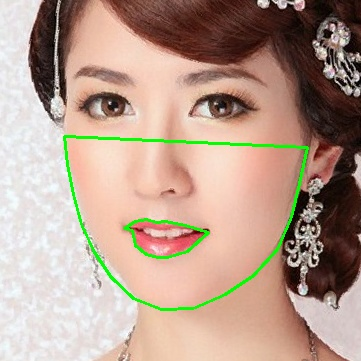

# Makeup Transfer with GAN

## Overview
<p align="center"></p>

This project aims to reproduce the CA-GAN paper using our own dataset, which includes a variety of skin tones based on the Monk Skin Tone Scale. The goal is to generate predicted lipstick colors based on the skin tone and the original images provided.

## Dependencies
- [Python 3.5+](https://www.continuum.io/downloads)
- [PyTorch 0.4.0+](http://pytorch.org/)
- [TensorFlow 1.3+](https://www.tensorflow.org/) (optional for TensorBoard)

## Steps

### Step 1: Retrieve Original and Target Lip Makeup Color
- **Original Lip Color:** Crop the lips from the image to extract the makeup color.
  - Example:
  <p align="center"></p>
- **Target Makeup Color:** Display the result of the retrieved makeup color on the face.
  - Example:
  <p align="center"></p>

### Step 2: Train with CA-GAN Model
- Train the model using the CA-GAN architecture.
- Model Structure:
  - Example: `jpg/model.png`

### Step 3: Generate Results
- Generate and visualize the results.
- Display charts and final images.

## Results
- **Makeup Transfer:** Left: source image / Middle: result image / Right: target image.
  - Example:
  <p align="center"></p>
- **Dark Skin Tone:** Left: source image / Middle: result image / Right: target image.
  - Example:
  <p align="center"></p>
- **Light Skin Tone:** Left: source image / Middle: result image / Right: target image.
  - Example:
  <p align="center"></p>

## Citation
- **CA-GAN Paper:** [Link to paper](https://arxiv.org/abs/2008.10298)
- **StarGAN Paper:** [Link to paper](https://arxiv.org/abs/1711.09020)
  
```bibtex
@inproceedings{choi2018stargan,
  author={Yunjey Choi and Minje Choi and Munyoung Kim and Jung-Woo Ha and Sunghun Kim and Jaegul Choo},
  title={StarGAN: Unified Generative Adversarial Networks for Multi-Domain Image-to-Image Translation},
  booktitle={Proceedings of the IEEE Conference on Computer Vision and Pattern Recognition},
  year={2018}
}

@inproceedings{kips2020gan,
  title={Ca-gan: Weakly supervised color aware gan for controllable makeup transfer},
  author={Kips, Robin and Gori, Pietro and Perrot, Matthieu and Bloch, Isabelle},
  booktitle={Computer Vision--ECCV 2020 Workshops: Glasgow, UK, August 23--28, 2020, Proceedings, Part III 16},
  pages={280--296},
  year={2020},
  organization={Springer}
}
